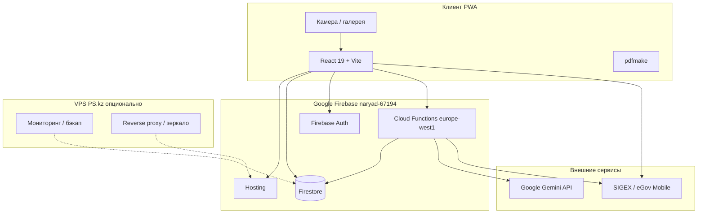

# Техническое задание  
# Система электронного наряд-допуска **NOVA Safety** (e-PTW)

**Заказчик:** ТОО «Урал Ойл энд Газ» (UOG)  
**Исполнитель:** [указать организацию-разработчик]  
**Версия документа:** 1.0  
**Дата:** 27.05.2026  
**Статус:** действующая спецификация на базе развёрнутого прототипа  

**URL прототипа:** https://naryad-67194.web.app  
**Firebase-проект:** `naryad-67194`  

---

## 1. Назначение и цели

### 1.1. Назначение

Веб-приложение **NOVA Safety** автоматизирует полный цикл оформления наряд-допуска (НД) на опасные работы в соответствии с внутренними процедурами UOG (PR-007, UOG-HSE-PR-001 и связанные формы):

1. **ППР** — программа производства работ (загрузка документа, извлечение данных ИИ).
2. **НДПР** — наряд-допуск на производство работ (реквизиты, сроки, бригада, **фотофиксация участка**).
3. **АСОР / ОТ·ТБ·ООС** — оценка рисков, мероприятия по охране труда.
4. **Согласование** — поэтапная ЭЦП через SIGEX / eGov Mobile (роли 10.1–10.4).
5. **PDF-пакет** — официальный бланк с таблицами ППР, опасными факторами, фото и подписями.

### 1.2. Цели внедрения

| № | Цель | Критерий успеха |
|---|------|-----------------|
| 1 | Сократить время оформления НД | Один пакет ППР→НДПР→АСОР без бумажного дублирования |
| 2 | Юридически значимая ЭЦП | Подписи permitter → issuer → performer → leadExpert |
| 3 | Фиксация состояния участка | До 6 фото с подписью, в карточке наряда и PDF |
| 4 | Работа на объекте с телефона | PWA, камера, офлайн-кэш Firestore |
| 5 | Аудит и хранение | Журнал нарядов, статусы, отклонения, хэш PDF |

### 1.3. Пользователи

| Роль | Функции |
|------|---------|
| Производитель работ | Создание пакета, фото, подпись 10.3 |
| Допускающий | Подпись 10.1 |
| Выдающий НД | Подпись 10.2, выдача |
| Ведущий специалист (кат. 1) | Утверждение 10.4 |
| Координатор HSE | Создание, согласование текущего шага очереди |
| Администратор | Управление пользователями, журнал |
| Работник бригады | Ознакомление (планируется — учётные записи) |

---

## 2. Область работ (функциональные требования)

### 2.1. Журнал нарядов

- Список нарядов с фильтрами по статусу.
- Кнопки **«Создать (с ППР)»** / **«Начать с ППР»** → сброс сессии, переход на `/ppr?fresh=1`.
- Карточка наряда: реквизиты, статус, PDF, очередь подписей, отклонение.

### 2.2. Шаг 1 — ППР

- Загрузка DOC/DOCX/PDF (до 15 МБ).
- ИИ (Google Gemini): описание работ, этапы, объём, меры контроля.
- Сохранение вложения в сессии и в документе наряда.
- Кнопка **«Далее — НДПР»** после заполнения gate.

### 2.3. Шаг 2 — НДПР

- Поля: организация, объект, вид работ, зона, описание, этапы, объём, инструменты.
- **Фотофиксация места работ (новое):**
  - Кнопки «Сфотографировать» (`capture="environment"`) и «Из галереи».
  - До **6** снимков, сжатие до ~1280 px, JPEG ~82 %, лимит **900 КБ** на фото.
  - Подпись к каждому фото (необязательно).
  - Хранение в поле `sitePhotos[]` документа Firestore.
- Назначение ролей (производитель, допускающий, выдающий, ведущий специалист).
- Сроки работ, бригада (F03), регистрационный номер.
- Автосохранение черновика в `sessionStorage`.

### 2.4. Шаг 3 — АСОР / ОТ·ТБ·ООС

- Матрица рисков, задания, опасные факторы, меры защиты.
- Блок согласований 10.1–10.4.
- Отправка на согласование → генерация PDF-пакета.

### 2.5. Электронная подпись (SIGEX / eGov)

- Порядок: **permitter (10.1) → issuer (10.2) → performer (10.3) → leadExpert (10.4)**.
- QR-код в модальном окне, проверка CMS на сервере (`submitEgovSignature`).
- Координатор может подписать **только текущий** шаг очереди.
- Серверные функции: `getSigningDocument`, `submitEgovSignature`, `extractPprControlMeasures` (Gemini).

### 2.6. PDF-пакет

- Генерация на клиенте (pdfmake) и/или на сервере (Cloud Functions).
- Разделы: сводка, данные ППР, мероприятия ОТ·ТБ·ООС, таблица опасных факторов, бригада, **фотофиксация**, блок 10.1–10.4 с отметками ЭЦП.
- Скачивание из карточки наряда.

### 2.7. Планируемые доработки (этап 2)

- Вкладка сертификатов (PR-012, PR-001, PR-007-R, PR-055, PL-003).
- ABR в PDF + AI-панель.
- Реестр НД (переименование «Матрица НД»).
- Учётные записи бригады для ознакомления.
- Миграция фото в **Firebase Storage** (см. п. 5.4).

---

## 3. Нефункциональные требования

| Параметр | Требование |
|----------|------------|
| Язык UI | Русский |
| Браузеры | Chrome 100+, Safari iOS 15+, Edge 100+ |
| Мобильность | Адаптивная вёрстка, PWA, доступ к камере (HTTPS) |
| Доступность | HTTPS обязателен для камеры и ЭЦП |
| Производительность | Открытие журнала < 3 с при ≤ 500 нарядов |
| Безопасность | Firestore Rules, проверка ролей на Functions |
| Резервирование | Firebase + ежедневный экспорт Firestore (опционально на VPS) |
| Логирование | Firebase Console, Cloud Functions logs |

---

## 4. Архитектура решения



### 4.1. Стек технологий

| Слой | Технология |
|------|------------|
| Frontend | React 19, TypeScript, Vite 8, React Router 7 |
| PWA | vite-plugin-pwa, Service Worker |
| Backend | Firebase Cloud Functions (Node.js 20), europe-west1 |
| БД | Cloud Firestore |
| Файлы | Base64 в Firestore (фото, ППР); Storage — этап 2 |
| PDF | pdfmake (клиент), pdfkit (сервер) |
| ИИ | Google Gemini (клиент + Functions) |
| ЭЦП | sigex-qr-signing-client, SIGEX REST API |
| CI/CD | `npm run deploy:hosting`, `deploy:functions`, `deploy:all` |

### 4.2. Модель данных (ключевые поля наряда)

```
permits/{id}
  title, siteName, workDescription, workStages, workVolume
  permitType, category, zoneClass, specialWorkActivity
  f02 { company, startDate, endDate, ... }
  executors[]
  ppr { attachment, workTitle, controlMeasures, ... }
  asor { tasks[], approvals[], ... }
  sitePhotos[] { id, caption, dataUrl, capturedAtIso, sizeBytes }
  egovSignatures { permitter, issuer, performer, leadExpert }
  packagePdf { fileName, documentHash, generatedAtIso }
  status, registrationRefNo, ...
```

---

## 5. Инфраструктура и VPS

### 5.1. Текущая схема (облако Firebase)

Основное приложение размещено в **Google Firebase** (план Blaze):

| Компонент | Ресурс | Регион |
|-----------|--------|--------|
| SPA | Firebase Hosting | CDN global |
| API / ЭЦП / ИИ | Cloud Functions | europe-west1 |
| Данные | Firestore | multi-region |
| Аутентификация | Firebase Auth | — |

**Преимущества:** не требует собственного сервера приложений, автоскейлинг, SSL из коробки.

**Ограничения:** зависимость от Google Cloud; для compliance может потребоваться резерв на VPS в РК.

### 5.2. Роль VPS (PS.kz или аналог)

VPS **не заменяет** Firebase в текущей архитектуре, а дополняет:

| Задача на VPS | Описание |
|---------------|----------|
| Мониторинг uptime | Uptime Kuma / Healthchecks → алерт в Telegram |
| Резервное копирование | Скрипт экспорта Firestore → S3/локальный диск (gcloud / Admin SDK) |
| Прокси для API | Nginx reverse proxy к SIGEX/Gemini при корпоративных ограничениях |
| Зеркало статики | Копия `dist/` для доступа по внутреннему DNS (опционально) |
| CI runner | Self-hosted runner для `npm run build && firebase deploy` |
| Журнал аудита | Централизованный сбор логов Functions (опционально) |

### 5.3. Рекомендуемые тарифы VPS (PS.kz, ориентир 2026)

| Профиль | CPU/RAM/SSD | Назначение | Ориентир ₸/мес |
|---------|-------------|------------|----------------|
| **Basic-2** | 2 vCPU / 2 GB / 40 GB | Мониторинг + nightly backup | ~7 000 |
| **Basic-3** | 2 vCPU / 4 GB / 80 GB | + CI runner, прокси | ~14 000 |
| **Basic-4** | 4 vCPU / 8 GB / 160 GB | Полный контур резервирования | ~28 000 |

**Минимальная рекомендация для UOG:** Basic-3 (4 GB RAM) — достаточно для бэкапов, мониторинга и лёгкого CI.

### 5.4. Сетевая схема с VPS

```
Пользователи (объект / офис)
        │
        ▼ HTTPS
naryad-67194.web.app  ──► Firebase Hosting (основной UI)
        │
        ├──► Firestore / Auth / Functions (Google)
        │
        └──► SIGEX, Gemini (интернет)

VPS (Алматы/Астана, PS.kz)
        │
        ├── cron: firestore-export.sh (03:00 daily)
        ├── uptime: ping web.app + functions health
        └── optional: nginx → зеркало dist или API proxy
```

### 5.5. Требования к VPS (технические)

| Параметр | Значение |
|----------|----------|
| ОС | Ubuntu 22.04 LTS |
| Node.js | 20 LTS (для скриптов бэкапа) |
| ПО | nginx, certbot, gcloud CLI или firebase-tools, docker (опционально) |
| Firewall | UFW: 22 (SSH ограничен), 80/443 (если прокси) |
| SSH | Только ключи, отключить root login |
| Диск | ≥ 80 GB (бэкапы Firestore + логи 90 дней) |
| DNS | A-запись `backup.uog.local` или внешний поддомен при зеркале |

### 5.6. Скрипт резервного копирования (эталон)

```bash
#!/bin/bash
# /opt/nova/backup-firestore.sh
export GOOGLE_APPLICATION_CREDENTIALS=/opt/nova/sa-firestore.json
BUCKET=gs://naryad-67194-backups
DATE=$(date +%Y%m%d)
gcloud firestore export $BUCKET/$DATE --project=naryad-67194
find /var/backups/nova -mtime +30 -delete
```

Cron: `0 3 * * * /opt/nova/backup-firestore.sh`

### 5.7. Стоимость эксплуатации (ориентир, месяц)

| Статья | Сумма |
|--------|-------|
| Firebase Blaze (Hosting + Firestore + Functions) | 15 000 – 45 000 ₸* |
| VPS Basic-3 (PS.kz) | ~14 000 ₸ |
| SIGEX (платный тариф при > 40 подписей/мес) | от 10 000 ₸ |
| Gemini API | по объёму запросов |
| Домен + SSL | 3 000 – 5 000 ₸ |

\* Зависит от числа нарядов, размера фото и вызовов Functions.

### 5.8. Деплой и доступы

| Действие | Команда / инструмент |
|----------|----------------------|
| Сборка | `npm run build` |
| Hosting | `npm run deploy:hosting` |
| Functions | `npm run deploy:functions` (требует IAM Cloud Build) |
| Правила Firestore | `npm run deploy:rules` |
| Полный деплой | `npm run deploy:all` |

**Требуемые IAM-роли:** Firebase Admin, Cloud Functions Developer, Service Account User для Cloud Build.

---

## 6. Безопасность и соответствие

- Все запросы по HTTPS.
- Firestore Security Rules: чтение/запись по `auth.uid` и роли в `users/{uid}`.
- Секреты (Gemini, SIGEX) — только в Functions environment / Secret Manager, не в клиентском bundle (кроме demo `VITE_GEMINI_API_KEY`).
- Фото содержат данные объекта — хранение в Firestore с теми же правилами, что и наряд.
- Персональные данные в ФИО работников — политика хранения согласно внутренним регламентам UOG.
- ЭЦП — проверка CMS через SIGEX на сервере перед записью в `egovSignatures`.

---

## 7. Приёмочные испытания

### 7.1. Сценарий «Полный пакет с фото»

1. Войти как координатор → Журнал → «Создать (с ППР)».
2. Загрузить ППР (PDF), дождаться извлечения ИИ → «Далее — НДПР».
3. Заполнить НДПР, сделать 2 фото с телефона, добавить подписи.
4. Перейти в ОТ·ТБ·ООС, заполнить АСОР, отправить на согласование.
5. Скачать PDF — убедиться в наличии раздела «Фотофиксация места работ».
6. Поочерёдно подписать 10.1–10.4 под соответствующими учётными записями.
7. Проверить статус «Согласован» и наличие ЭЦП в карточке.

### 7.2. Сценарий «Мобильная камера»

- Открыть `/new` на смартфоне (HTTPS).
- Нажать «Сфотографировать» — системная камера открывается.
- Фото появляется в сетке, сохраняется после создания наряда.

### 7.3. Сценарий «VPS бэкап»

- На VPS выполнить тестовый экспорт Firestore.
- Проверить наличие архива в bucket / локальной папке.
- Симулировать недоступность Hosting — алерт от мониторинга за ≤ 5 мин.

---

## 8. Этапы реализации

| Этап | Содержание | Срок* |
|------|------------|-------|
| 1 | ППР → НДПР → АСОР, журнал, PDF | ✅ Выполнено |
| 2 | ЭЦП 10.1–10.4, очередь подписей | ✅ Выполнено |
| 3 | **Фотофиксация при НДПР, PDF** | ✅ Выполнено |
| 4 | Деплой Functions, исправление IAM | 3–5 дней |
| 5 | VPS: мониторинг + бэкап | 5–7 дней |
| 6 | Firebase Storage для фото, сертификаты | 15–20 дней |

\* Ориентировочно, уточняется календарным планом проекта.

---

## 9. Передаваемые артефакты

1. Исходный код репозитория `e-ptw` (React + Functions).
2. Данное ТЗ и инструкция по деплою.
3. Firebase-проект с настроенными Rules и Hosting.
4. Документация по ролям пользователей (`bootstrap-admin`, `bootstrap-roles`).
5. Скрипты резервного копирования для VPS.
6. Реестр сторонних лицензий (`THIRD-PARTY-LICENSES`).

---

## 10. Глоссарий

| Термин | Определение |
|--------|-------------|
| НД / НДПР | Наряд-допуск на производство работ |
| ППР | Программа производства работ |
| АСОР | Анализ безопасности операций работ |
| ЭЦП | Электронная цифровая подпись (НУЦ РК, eGov) |
| SIGEX | Платформа подписания документов |
| PWA | Progressive Web App — веб-приложение с офлайн-кэшем |
| VPS | Виртуальный сервер (выделен для бэкапов и мониторинга) |

---

**Утверждение**

| | Заказчик | Исполнитель |
|---|----------|-------------|
| Должность | | |
| ФИО | | |
| Подпись | | |
| Дата | | |
